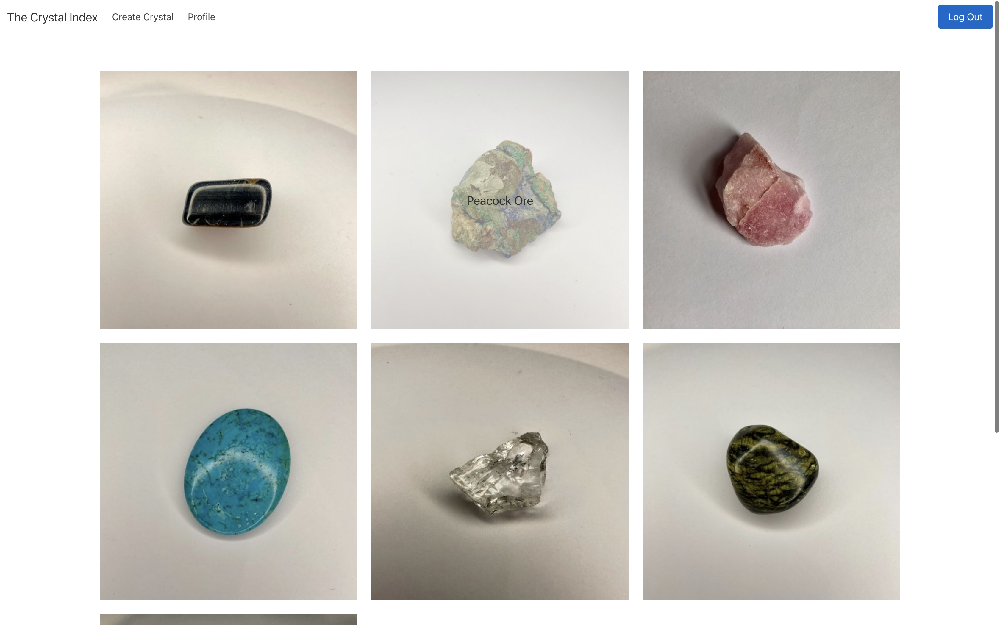
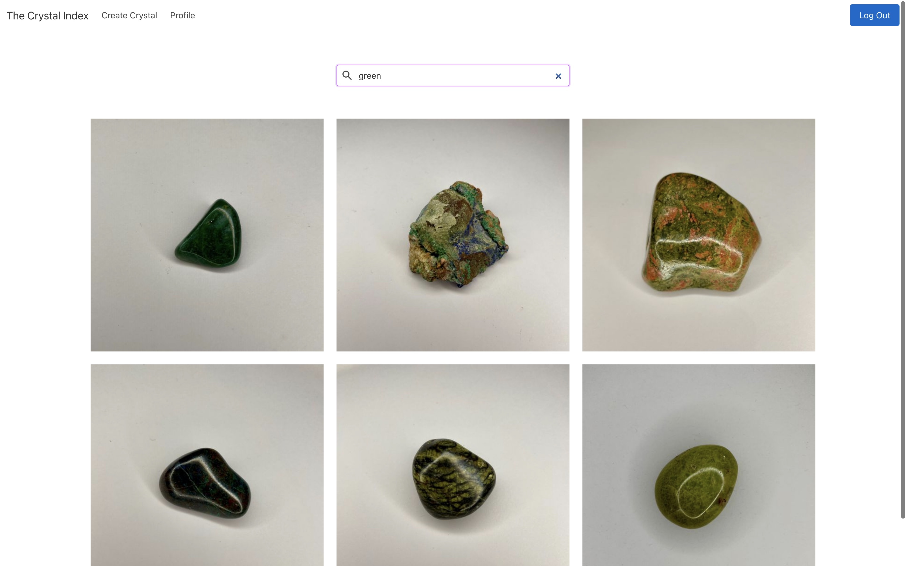
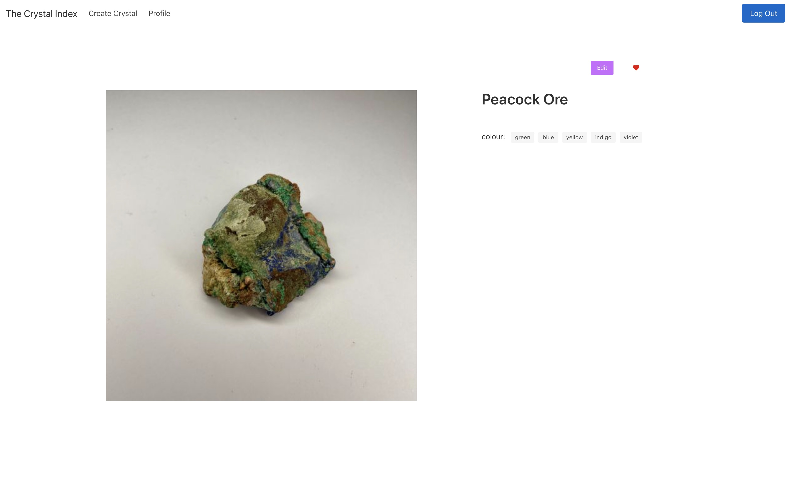

# 🔮 The Crystal Index

[Live Site](www.crystalindex.co.uk)

A full-stack Next.js app, which is an index to record crystals, employing a Prisma as an ORM. Crystal information is created with GPT4. Location data is looked up and added using the OpenCage API. Location data is visualised with a 3D globe created with React 3 Fiber.

## Details

### Timeframe

On-going

### Technologies Used

* Next
* TypeScript
* Prisma
* SQL
* GPT4
* React 3 Fiber
* Bcrypt
* Hapi

### App Overview

This app was created as a solution to document an ever growing collection of crystals which have been purchased from all over the globe as mementos of holidays, and then being a searchable database to rediscover old crystals or identify new ones.

#### Development Process

The most important piece of architecture to design for the app was the relational database models.
I wanted to record the basic information about the crystals alongside locational information not only about where the crystal originated from, but where the crystal was bought. This meant that a location was a database model which crystals were belonged to, by either origin or memento.

#### Functionality

##### Main Gallery

The homepage is a gallery view of all the crystals on the database.

This page includes a search feature where crystals may be searched by multiple properties including: name, origin location, memento location, colour and chakra.

##### Crystal Page

All of the information about the crystal is displayed on each crystals' page. This is where users can favourite a crystal, and if they are the creator of the entry, a user can amend information and see crystal properties which are personal to them, such as the memento location.

### Challenges & Achievements

An achievement is storing images as binary arrays on the database, instilling a fast loading time for images, which will continue to increase in number.
